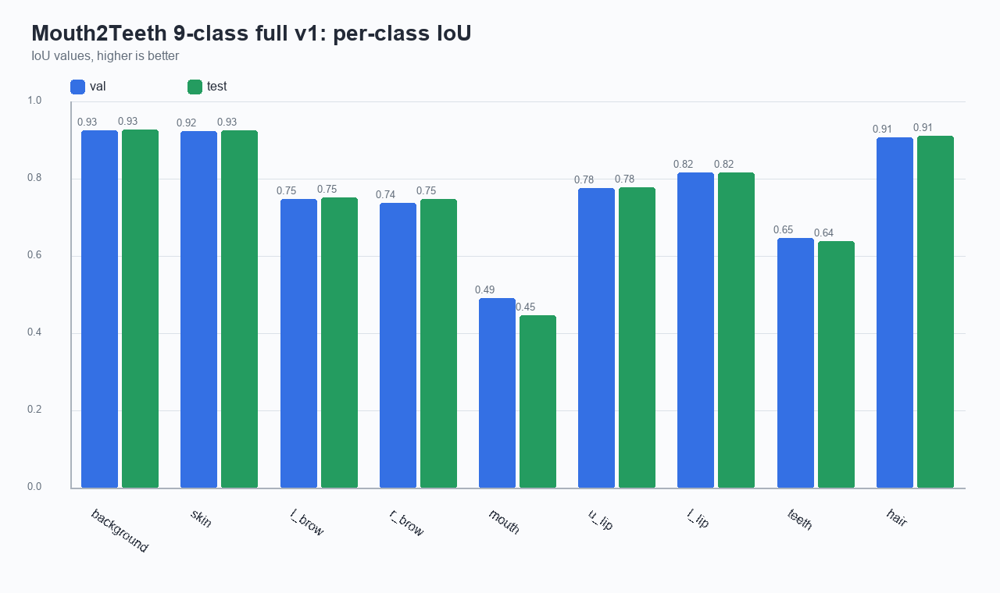
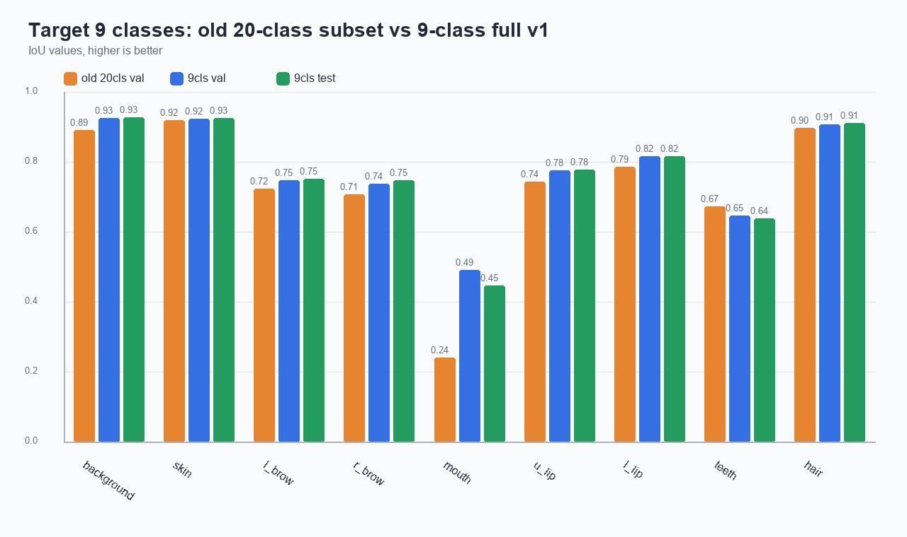
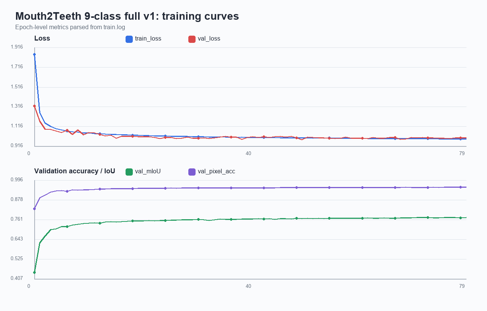
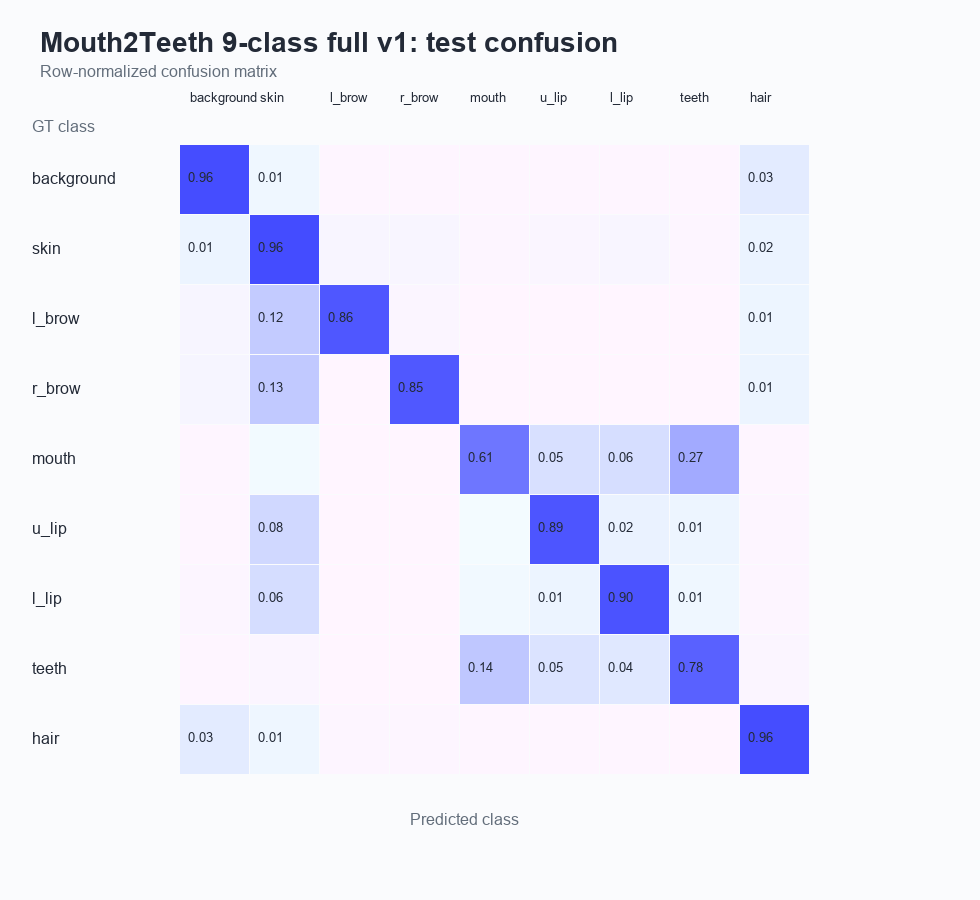
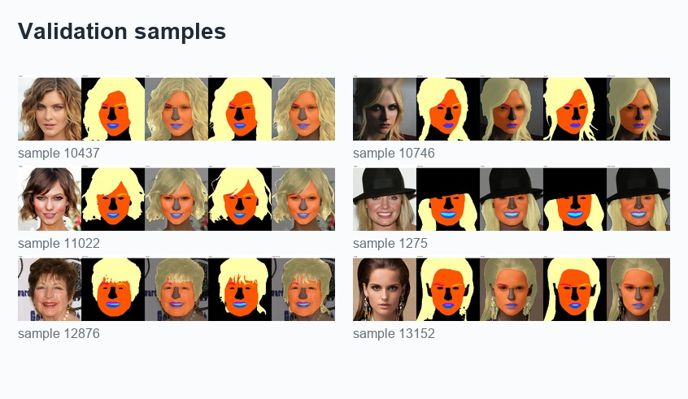
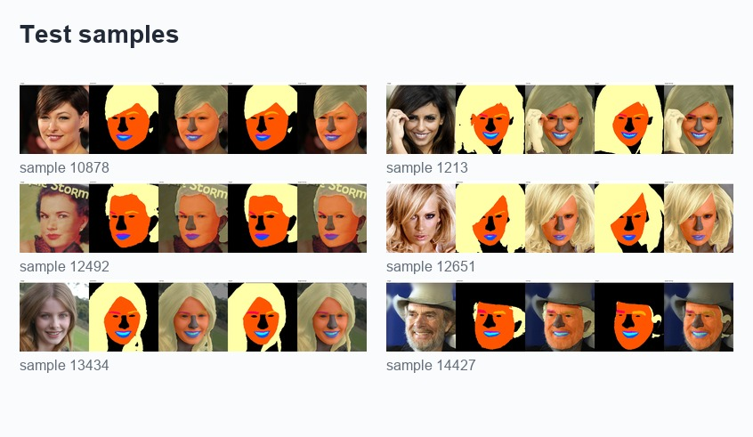

# Mouth2Teeth 9 类 full v1 训练结果报告

## 概览

本报告汇总 `feature/mouth2teeth-9class` 分支的 9 类完整数据训练结果。模型输出类别从 20 类缩减到 9 类：`background`、`skin`、`l_brow`、`r_brow`、`mouth`、`u_lip`、`l_lip`、`teeth`、`hair`。

| 指标 | val | test |
| --- | ---: | ---: |
| `loss` | 1.0043 | 0.9849 |
| `ce` | 0.7518 | 0.7325 |
| `dice` | 0.2205 | 0.2212 |
| `boundary` | 0.7109 | 0.7096 |
| `pixel_acc` | 0.9556 | 0.9574 |
| `mean_acc` | 0.8666 | 0.8634 |
| `mean_iou` | 0.7752 | 0.7722 |
| 样本数 | 1500 | 1500 |

Checkpoint：`outputs/train_mouth2teeth_9cls_full_v1/best.pt`

训练共记录 `80` 个 epoch，最终 epoch `79` 的 train loss 为 `0.9905`，val mIoU 为 `0.7752`。

日志中最高 val mIoU 出现在 epoch `79`，val mIoU 为 `0.7752`。

## 关键结论

- 当前 9 类 full v1 在 val/test 上表现接近：val mIoU `0.7752`，test mIoU `0.7722`，没有明显过拟合信号。
- 与之前 20 类小批次模型的目标 9 类平均 IoU `0.7321` 相比，当前 val 提升 `+0.0430`，test 提升 `+0.0400`。
- `mouth` 相比旧模型提升最大：旧模型 `0.2409`，当前 val `0.4913`，test `0.4475`。
- `teeth` 低于旧小批次结果：旧模型 `0.6742`，当前 val `0.6467`，test `0.6387`；主要风险仍是 `mouth/teeth/lip` 边界混淆。
- 9 类 TFLite 已导出并通过 smoke test，输出 shape 为 `[1, 9, 320, 320]`，符合移动端缩小输出类别的目标。

## Per-class IoU

| Class | old 20cls val | 9cls val | 9cls test | val delta | test delta |
| --- | ---: | ---: | ---: | ---: | ---: |
| `background` | 0.8922 | 0.9254 | 0.9287 | +0.0332 | +0.0365 |
| `skin` | 0.9202 | 0.9243 | 0.9256 | +0.0041 | +0.0054 |
| `l_brow` | 0.7247 | 0.7489 | 0.7520 | +0.0243 | +0.0273 |
| `r_brow` | 0.7083 | 0.7384 | 0.7487 | +0.0301 | +0.0404 |
| `mouth` | 0.2409 | 0.4913 | 0.4475 | +0.2504 | +0.2067 |
| `u_lip` | 0.7437 | 0.7761 | 0.7782 | +0.0323 | +0.0345 |
| `l_lip` | 0.7868 | 0.8180 | 0.8171 | +0.0313 | +0.0303 |
| `teeth` | 0.6742 | 0.6467 | 0.6387 | -0.0274 | -0.0355 |
| `hair` | 0.8982 | 0.9073 | 0.9130 | +0.0092 | +0.0149 |

## 与之前小批次模型对比

| 项目 | 之前 20 类小批次 val | 当前 9 类 full val | 当前 9 类 full test |
| --- | ---: | ---: | ---: |
| 样本数 | 122 | 1500 | 1500 |
| 全局 mIoU | 0.6639 | 0.7752 | 0.7722 |
| 目标 9 类平均 IoU | 0.7321 | 0.7752 | 0.7722 |
| pixel_acc | 0.9367 | 0.9556 | 0.9574 |
| mean_acc | 0.7662 | 0.8666 | 0.8634 |

注意：20 类小批次模型和 9 类 full 模型的类别空间、数据规模和验证集都不同，因此全局 mIoU 不能作为唯一判断依据；目标 9 类平均 IoU 更接近这次移动端模型的真实对比口径。

## 训练曲线

训练曲线显示 loss 在后期进入平台区，val mIoU 在最终阶段稳定在 `0.77+`。日志开头存在 PyTorch warning：AMP API 未来弃用，以及 `lr_scheduler.step()` 调用顺序提示；本次结果可用，但后续建议修正 scheduler 调用顺序，避免跳过首个 LR 值。

## 混淆矩阵

test 混淆矩阵显示，`mouth` 和 `teeth` 互相混淆较明显，`teeth` 也会被分到 `u_lip/l_lip`。这符合口腔内部区域边界弱、样本变化大的特点，是下一轮优化的主要方向。

## TFLite 导出

| 项目 | 值 |
| --- | --- |
| 模型文件 | `weights/head_parsing_mobile_320_mouth2teeth_9cls_fp16.tflite` |
| 大小 | `9.94 MB` |
| SHA256 | `51042a4b97aaf48ee7a4b702ca58b0f83db53f1addb90058af795a918a87dca7` |
| precision | `fp16` |
| converter | `litert_torch` |
| include_softmax | `False` |
| input_shape | `[1, 3, 320, 320]` |
| output_shape | `[1, 9, 320, 320]` |

当前 smoke test 使用 `107.jpg`，该样本预测中 `mouth=0`、`teeth=0`，更适合作为链路检查，不适合作为牙齿效果验证。后续端侧回归应增加一张明确包含牙齿的样本。

## Smoke test 预测类别像素

| Class | Pixels |
| --- | ---: |
| `background` | 41356 |
| `skin` | 25815 |
| `l_brow` | 545 |
| `r_brow` | 379 |
| `mouth` | 0 |
| `u_lip` | 372 |
| `l_lip` | 708 |
| `teeth` | 0 |
| `hair` | 33225 |

## 样本可视化

### Validation

### Test

## 产物记录

完整 SHA256 记录见 `artifacts.json`。原始 `outputs/` 和 `.tflite` 文件按 `.gitignore` 保留在本机，不直接提交。

| Artifact | Size | SHA256 |
| --- | ---: | --- |
| `outputs/eval_mouth2teeth_9cls_full_v1_val/metrics_val.json` | 0.0 MB | `5cfe3fd236ab9ab1...` |
| `outputs/eval_mouth2teeth_9cls_full_v1_test/metrics_test.json` | 0.0 MB | `4dcd5ead7f89af83...` |
| `outputs/train_mouth2teeth_9cls_full_v1_train.log` | 0.17 MB | `0cedc910e8bd85c1...` |
| `outputs/tflite_export_mouth2teeth_9cls_report.json` | 0.0 MB | `e8c0e61befba4660...` |
| `outputs/tflite_smoke_mouth2teeth_9cls/tflite_smoke_report.json` | 0.0 MB | `a96c96ebd9f6dcc8...` |
| `weights/head_parsing_mobile_320_mouth2teeth_9cls_fp16.tflite` | 9.94 MB | `51042a4b97aaf48e...` |

## 后续建议

1. 选取 teeth-positive 图片重新跑 TFLite smoke test，确认移动端链路能输出 `teeth`。
2. 若下一轮继续优化，优先增强 `mouth/teeth/lip` 边界样本，或针对这些类别调整 loss 权重。
3. Android demo 目前仍主要围绕 20 类模型命名和资产，接入 9 类模型前需要同步 metadata、类别 ID 和 UI 展示。
