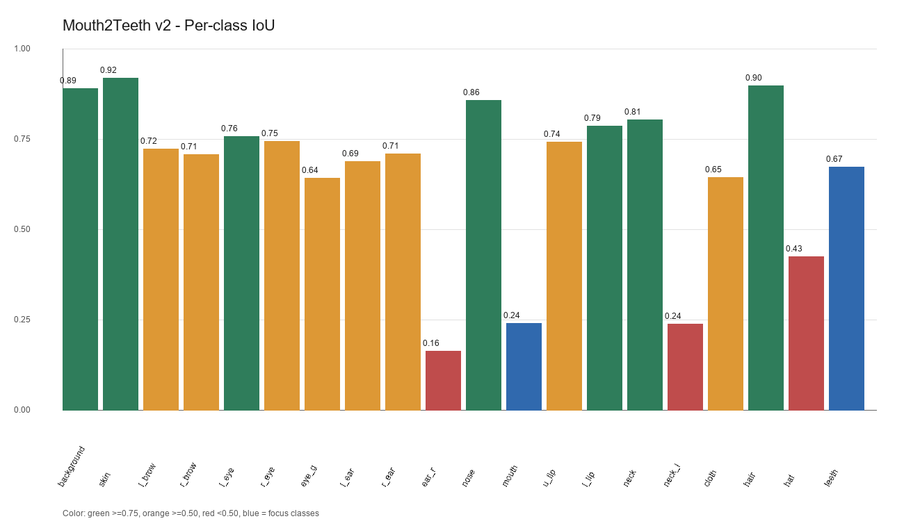
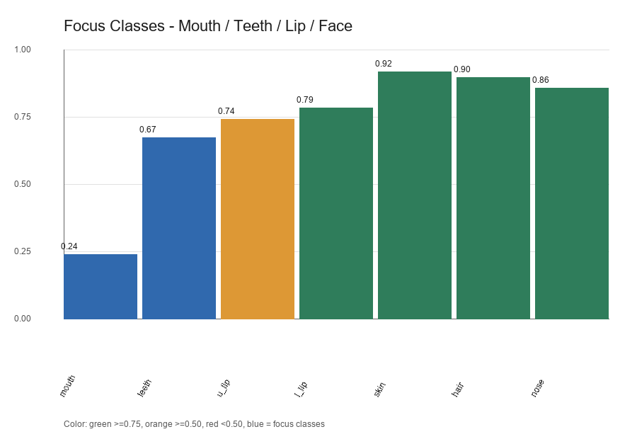
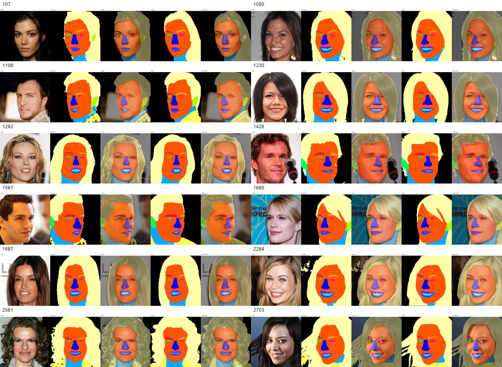

# Mouth2Teeth v2 训练结果报告

## 概览

本报告汇总 20 类 `HeadParsingMobile` 的 mouth2teeth 实验结果。类别顺序保持原始 CelebAMask-HQ 的 19 类不变，并将 `teeth` 追加为 class ID 19。

| 指标 | 数值 |
| --- | ---: |
| `loss` | 1.2521 |
| `ce` | 0.8929 |
| `dice` | 0.3905 |
| `boundary` | 0.8200 |
| `pixel_acc` | 0.9367 |
| `mean_acc` | 0.7662 |
| `mean_iou` | 0.6639 |

验证集：`val`  
验证样本数：`122`  
Checkpoint：`outputs/train_mouth2teeth_v2/best.pt`

## 关键结论

- `teeth` IoU 为 `0.6742`，说明新增类别已经正确进入 processed mask，并且模型已经学到该类别。
- 表现较好的类别：`skin` 0.920、`hair` 0.898、`background` 0.892、`nose` 0.860、`neck` 0.806。
- 表现较弱的类别：`ear_r` 0.164、`neck_l` 0.239、`mouth` 0.241、`hat` 0.427、`eye_g` 0.642。
- `mouth` IoU 为 `0.2409`。由于原 mouth 区域被拆分为 `mouth + teeth`，该类别下降是预期风险；后续应重点看 mouth、teeth、upper/lower lip 的边界质量。
- 本轮训练没有保存 `train.log`，因此无法还原 epoch 级 loss / mIoU 曲线。后续训练应使用 README 中带 `tee outputs/<run_id>/train.log` 的命令。

## Teeth 像素诊断

| 项目 | 数值 |
| --- | ---: |
| TP pixels | 40741 |
| GT teeth pixels | 48196 |
| Pred teeth pixels | 52977 |
| Union pixels | 60432 |
| IoU | 0.6742 |

## Per-class IoU

| Class | IoU |
| --- | ---: |
| `background` | 0.8922 |
| `skin` | 0.9202 |
| `l_brow` | 0.7247 |
| `r_brow` | 0.7083 |
| `l_eye` | 0.7585 |
| `r_eye` | 0.7451 |
| `eye_g` | 0.6424 |
| `l_ear` | 0.6903 |
| `r_ear` | 0.7115 |
| `ear_r` | 0.1643 |
| `nose` | 0.8596 |
| `mouth` | 0.2409 |
| `u_lip` | 0.7437 |
| `l_lip` | 0.7868 |
| `neck` | 0.8056 |
| `neck_l` | 0.2392 |
| `cloth` | 0.6458 |
| `hair` | 0.8982 |
| `hat` | 0.4265 |
| `teeth` | 0.6742 |

## 重点类别对比

## 可视化样本

下图由评估阶段保存的 grid 样本生成。每个 grid 包含原图、预测、预测叠加、GT、GT 叠加。

## 模型产物

| Artifact | 大小 | SHA256 |
| --- | ---: | --- |
| `head_parsing_mobile_320_teeth_best.pt` | 19.96 MB | `2bcfc8660feb9ffb...` |
| `head_parsing_mobile_320_teeth.onnx` | 9.83 MB | `a6a16ceeeeba7664...` |
| `head_parsing_mobile_320_teeth_fp16.tflite` | 9.95 MB | `34b2d2f63e9a9b05...` |

完整 SHA256 记录在 `artifacts.json`。

## 建议

当前模型可以进入移动端集成测试，优先使用已导出的 TFLite 产物验证端侧速度和视觉效果。下一轮训练需要保留 `train.log`，以便生成训练曲线；同时建议固定一个 teeth-positive validation subset，用于后续回归对比。
